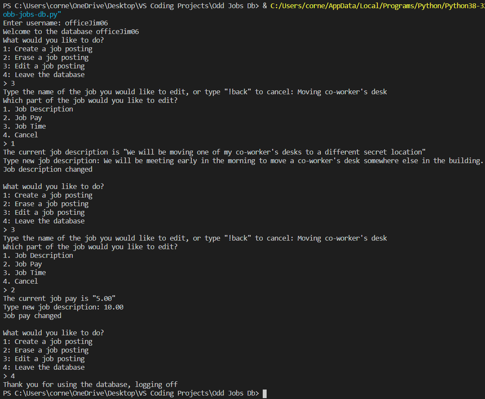

# Overview
A database program that allows a user to edit a google firestore database. This specific database is used to allow users to make job postings, edit them, and delete them. Created with Python, Visual Studio Code, Github/GIT, and a bit of Google Firestore (Google firebase module)

# Developement Enviroment

* Visual Studio Code
* Python 3.8.5 32-bit

# Execution

To run the program: `python odd-jobs-db.py` or click the play button in Visual Studio Code. (NOTE: This will only work if you have the private key.)
This code is just for show

# Useful Information

[Python3 Documentation Reference](https://docs.python.org/3/)
[Google Firebase Admin SDK Reference](https://firebase.google.com/docs/reference/admin)